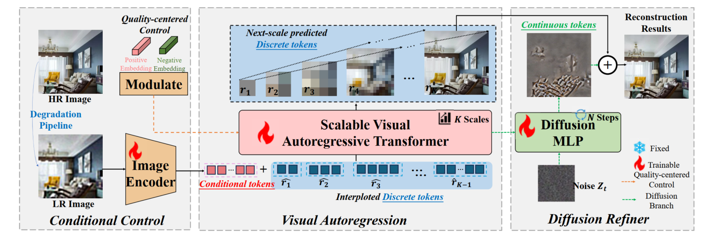
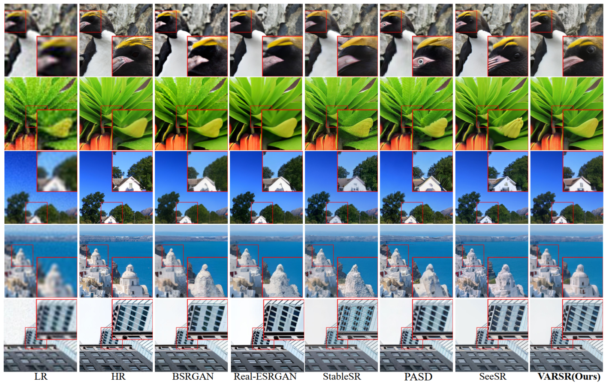

# VARSR: Visual Autogressive Modeling for Image Super Resolution
<div align="center">

[](https://arxiv.org/abs/2501.18993)&nbsp;
[](https://huggingface.co/qyp2000/VARSR)&nbsp;


Yunpeng Qu<sup>1,2</sup> | Kun Yuan<sup>2</sup> | Jinhua Hao<sup>2</sup> | Kai Zhao<sup>2</sup> | Qizhi Xie<sup>1,2</sup> | Ming Sun<sup>2</sup> | Chao Zhou<sup>2</sup>

<sup>1</sup>Tsinghua University, <sup>2</sup>Kuaishou Technology.
</div>

## 🚀 Overview framework

Image Super-Resolution (ISR) has seen significant progress with the introduction of remarkable generative models. However, challenges such as the trade-off issues between fidelity and realism, as well as computational complexity, have also posed limitations on their application. Building upon the tremendous success of autoregressive models in the language domain, we propose \textbf{VARSR}, a novel visual autoregressive modeling for ISR framework with the form of next-scale prediction. To effectively integrate and preserve semantic information in low-resolution images, we propose using prefix tokens to incorporate the condition. Scale-aligned Rotary Positional Encodings are introduced to capture spatial structures and the diffusion refiner is utilized for modeling quantization residual loss to achieve pixel-level fidelity. Image-based Classifier-free Guidance is proposed to guide the generation of more realistic images. Furthermore, we collect large-scale data and design a training process to obtain robust generative priors. Quantitative and qualitative results show that VARSR is capable of generating high-fidelity and high-realism images with more efficiency than diffusion-based methods.


## 🚀 Results



## 🔥Installation
```
## git clone this repository
git clone https://github.com/qyp2000/VARSR.git
cd VARSR

# create an environment with python >= 3.9
conda create -n varsr python=3.9
conda activate varsr
pip install -r requirements.txt
```


## 🔥Inference
#### Step 1: Download the pretrained models and test data
- Download VARSR and VQVAE model from <a href='https://huggingface.co/qyp2000/VARSR'></a> and put it into ``checkpoints/``.
- Prepare testing images in the `testset`.

#### Step 2: Run code
```
python test_varsr.py
```
You can modify the parameters to adapt to your specific need, such as the `cfg` which is set to 6.0 by default.

## 🔥 Train 

#### Step1: Download the pretrained models and training data
- Download VQVAE model from <a href='https://huggingface.co/qyp2000/VARSR'></a> and put it into ``checkpoints/``.
- Download pretrained original VAR models from [VAR](https://github.com/FoundationVision/VAR) and put them into ``checkpoints/``. You can also use the C2I VARSR pretrained on our large-scale dataset, which can be downloaded from <a href='https://huggingface.co/qyp2000/VARSR'></a>
- Prepare your own training images, whose path should be changed in the file `dataloader/localdataset_lpm.py`.

#### Step2: Run code
```
torchrun --nproc-per-node=8 train.py --depth=24 --batch_size=4 --ep=5 --fp16=1 --tblr=5e-5 --alng=1e-4 --wpe=0.01 --wandb_flag=True --fuse=0 --exp_name='VARSR'
```
You can modify the parameters in `utils/arg_util.py` to adapt to your specific need, such as the `batch_size` and the `learning_rate`.


## Citations
If our work is useful for your research, please consider citing and give us a star ⭐:
```
@article{qu2025visual,
  title={Visual Autoregressive Modeling for Image Super-Resolution},
  author={Qu, Yunpeng and Yuan, Kun and Hao, Jinhua and Zhao, Kai and Xie, Qizhi and Sun, Ming and Zhou, Chao},
  journal={arXiv preprint arXiv:2501.18993},
  year={2025}
}
```

## Contact
Please feel free to contact: `qyp21@mails.tsinghua.edu.cn`. 
I am very pleased to communicate with you and will maintain this repository during my free time.

## Acknowledgments
Some codes are brought from [VAR](https://github.com/FoundationVision/VAR), [MAR](https://github.com/LTH14/mar) and [HART](https://github.com/mit-han-lab/hart). Thanks for their excellent works.
